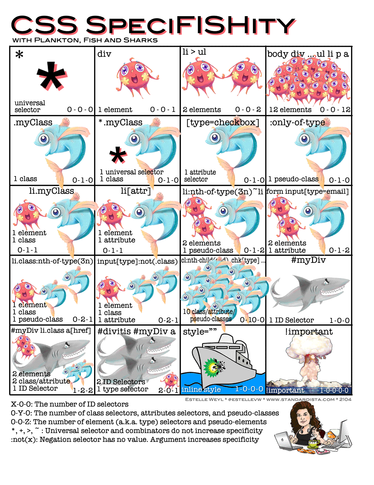

# Frontend Master Introduction to Dev Tools, v3

## Enter Chrome Dev Tools

To enter chrome dev tools, we can do a few things:
- Right click on the website, and click `inspect`.
- Use keyboard shortcut `command+option+c` on mac or `ctrl-shift-c`
on windows or linux.

> Not sure what is the difference, but we can also use `F12` to trigger
> chrome dev tools too.

## The Chrome Dev Tools Panels

**The chrome extensions that we add to our browser can and often mess with dev
tools data because they can mess with how we actually render websites**. This
can lead to really inaccurate reporting.

> We can change the panel order by dragging the specific panel.

Here's a list of panels in chrome dev tools in no particular order (with a
brief explanation):
1. Elements:
  - View html and CSS.
  - Add/change classes and IDs.
  - Update styles.

2. Network:
  - View all files sent from server.
  - Measure page load performance.
  - Watch our site load in real time.
  - Inspect request/response data.

3. Performance:
  - Record CPU and Memory usage.
  - Inspect threads.
  - Spot page jank.

4. Console:
  - Javascript REPL.
  - Interact with DOM.

5. Security:
  - Check if the request use HTTPS.
  - View certificates.
  - View any TLS/SSL issue.

6. Sources:
  - A full IDE.
  - Step through debugger.
  - Persist changes to disk.

7. Application:
  - Application storage.
  - Check PWA features.
  - Clear cache.

8. Memory:
  - Generate memory snapshots.
  - Find and fix memory leaks.

9. Lighthouse:
  - Full website audit.
  - Check performance, SEO, Accessibility.

## Console Panels

Console panels is a javasript REPL. It comes with `$0` which is the last
element from the Elements panels and we can interact with it like this:
```sh
$0.addEventListener(...)
```

## CSS Specificity

CSS is kind of an interesting language because it doesn't have a compile time
and doesn't have errors.

For example, if we wrote some CSS like `class` of `foo` background `red` and
then right afterwards we wrote `class` of `foo` background `blue`. How is CSS
suppose to deal with that? In javascript, it would throw an error.

CSS also weird because, when we write CSS, CSS isn't aware of the layout it
actually renders. Here's an example:<br>
let's say we write all `div` are blue and anything with `class` of `foo` is
red, but then, let's say we make a div with the class of foo. Now all of a
sudden CSS has a problem.

So, what CSS does is follows these rules called CSS specificity. Below is the
illustration for CSS specificity:


## HTML Breakpoint

Just like how we set break points in our javascript code which we'll learn in
the next section, we can set break point on our html code.

If we go to one of the html tag, let's say `<head>` and then right click on
`<head>`. After that, select `Break on` drop down. So, what that's doing is
says "when one of these three things (the options inside `Break on`) happens,
i want you to pause javascript execution and i want you to show me what
javascript caused the html to change".

There's three options for `Break on`:
- Subtree modifications.
- Attribute modifications.
- Node removal.

### Subtree Modifications

Subtree is basically a child of a root. Let's say `<head>` has `<title>`
inside of it, that means `<title>` is a subtree of `<head>`.

So, with that in mind. Subtree modifications is basically stop the javascript
process if one of the subtree changed.

### Attribute Modifications

Let's say we have this html element:
```html
<h1 id="lesson-2-what-can-devtools-do-">Lesson 2 - What can DevTools do?</h1>
```
the javascript process will stop if the attributes, which in this case `id`
changed.

### Node Removal

This will stop javascript process if the node is removed.

## Workspaces

Workspace live in Sources panel. So if we want to use workspace, we can go to
the Sources panel.

### Pros and Cons

Let's say we make an `index.html` manually, then when other people hit our
website, the same `index.html` that we hand wrote is gonna come to that person.
It's the same file, automatically transferred.

If we write a node app and use a templating language like react, and we hand
write a file, the templating language will turn that into an `index.html` and
send it to user.

The first example, when we hand wrote the `index.html` (without templating
language) works great with workspace.

The second example, when we're using templating language, that won't work with
the workspace. Because, if we update our `index.html` on our computer inside
the workspace, our server doesn't really have a way of knowing which template
file to update, that would be to complex.

So, in the situations above, we can still persist our CSS and our javascript
changes to disk, but we can't persist our html changes to this because we're
not actually writing html.

**Basically if it's the exact same thing on our code, then it's easy to
persist. And if it's not, then it's not going to persist**.

## Network Performance

Network performance is basically the performance of the things coming over the
network from our servers to our users.

**It's important to not just test on the best possible conditions, but also
think about our user base**.

> We can hold shift over an item in google chrome dev tools network panel,
> it'll turn everything that item called into red. And if that item was called
> by something, it'll turn the item that called the current item into green.
>
> Here's an example:
> 
> in the example above, the second item was called by the first item and the
> second item called the last two item.

**It's important to know that on the web browser level, we get only a certain
number of request, which is around 5 or 6 depending on the web browser, that
we can do at one time**.

For example, if we tried to call 20 images, it would send out six request for
the six images and as they come down, it will make another six request until we
got 20 images.

It's worth knowing that **we can't do unlimited requests**, and that's where we
get this culture of concatenating our javascript files or using CSS sprites
instead of images because **there's a performance gained to be had by having
less total requests**.

The other things that interesting is that, rather than just going down our html
and just like in queuing everything it sees, like script, CSS, CSS, and going
through, the browser tries to figure out things which has higher or lower
priority. And then, it goes into a priority list.

We can override the priority order, one of them is move things to the `head`
will make it a higher priority.

### Network Waterfall

Below is the breakdown of colors in the network waterfall column in google
chrome dev tools network panel:


Basically:
- White and grey means that too many requests. The browser just stuck, not even
working on those requests yet. So, we can concatenate our scripts, image
sprites, and all the cool stuff.
- Green and orange is the stuff that being set up on the service side. Maybe
there's hiccup with the DNS registry or SSL or something like that. If time
to first byte is slow, it's a service issue (maybe it's a database problem, or
the servers are overwhelm or they're just slow, or something like that).

> As we compress more and more, and we send more and more javascript
> specifically instead of images, parse time can become a really big bottleneck
> as well and it's something to keep in mind.
>
> The idea with compression being we take a javascript file, we run it through
> gzip, we get a much smaller file which is great because smaller file travel
> faster, but they have to be uncompressed on the client's machine. The user
> browser will uncompress it, and they still have to parse that giant amount of
> javascript.

## Measuring Real User Performance

We can use performance API to measure real user performance. For more info, you
can check the documentation: https://developer.mozilla.org/en-US/docs/Web/API/Performance

Performance API also appear in the performance panel in the dev tools, which is
quite convenient.

## On Page Performance

Google has this rail performance philosophy, and it's kind of four different
things to think about, four different considerations:
1. General app response time.
2. Animations.
3. Idle time.
4. Load.

> Page jank is any stuttering, juddering, or just plain halting that users
> see when a site or app isn't keeping up with the refresh rate.

> When we're doing the performance recordings is, there's a lot of information
> to process, so the shorter we can keep our performance recording, the better.

## Running Inspect With Node.js

When we run node with this command:
```sh
node --inspect <server.js>
```
and we open the dev tools, we'll see the node icon in the left corner like
this:<br>
<br>
and if we click that, we can get a node.js dev tools.

## What Can Slow Down a Website?

From backend:
  - Database
  - Server
  - Network
  - Compression

From frontend:
  - Large bundle
  - Too many files
  - Images or javascript not async
  - Images too large
  - Images uncompressed
  - Unused javascript or CSS
  - CSS in document body
  - Not using web browser caching

## References

- [Course github repo](https://github.com/jkup/mastering-chrome-devtools).
- [Official chrome dev tools docs](https://developers.google.com/web/tools/chrome-devtools).
- [Remote debug android devices](https://developer.chrome.com/docs/devtools/remote-debugging/).
